<div align="center">

<!-- ══ ANIMATED WAVING HEADER ══ -->


<br/>

<!-- ══ GREETING ══ -->
<h3>
  
  &nbsp;Hey there! I'm Yash — welcome to my GitHub&nbsp;
  
</h3>

<!-- ══ TYPING ANIMATION — using svg url encode without emojis for max compatibility ══ -->
<a href="https://git.io/typing-svg">
  
</a>

<br/><br/>

<!-- ══ HIGHLIGHT BADGE ROW ══ -->

&nbsp;

&nbsp;


<br/><br/>

<!-- ══ SOCIAL BADGES ══ -->
[](https://www.linkedin.com/in/yashprataprai)
&nbsp;
[](https://my-portfolio-kappa-one-29.vercel.app/)
&nbsp;
[](mailto:yashpratapraiofficial@gmail.com)

<br/>


&nbsp;


</div>

---

<!-- ══════════════════════ AGENTIC AI SECTION ══════════════════════ -->

<div align="center">

## 🤖 Currently Exploring — Gen AI & Agentic AI


</div>

```python
class YashPratapRai:
    """
    🤖 Aspiring Data Scientist | ML Engineer | Agentic AI Explorer
    """
    def __init__(self):
        self.name          = "Yash Pratap Rai"
        self.role          = "Data Scientist & ML Engineer"
        self.exploring     = ["Generative AI", "Agentic AI", "LLM Pipelines", "RAG Systems"]
        self.building      = ["AI Agents", "Tool-Calling LLMs", "Multi-Agent Workflows"]
        self.frameworks    = ["LangChain", "LangGraph", "AutoGen", "CrewAI"]
        self.models        = ["GPT-4", "Claude", "Gemini", "Open-Source LLMs"]
        self.current_focus = "🚀 Deploying autonomous AI agents that reason, plan & act"

    def mission(self):
        return "Build intelligent systems that think, learn & operate autonomously 🧠"

yash = YashPratapRai()
print(yash.mission())
# Output: Build intelligent systems that think, learn & operate autonomously 🧠
```

<br/>

<div align="center">

### 🌟 Gen AI & Agentic AI — Focus Areas

| 🧠 Generative AI | 🤖 Agentic AI | 🔗 LLM Engineering |
|:---:|:---:|:---:|
| LLMs & Prompt Engineering | Autonomous AI Agents | RAG Pipelines |
| Text & Content Generation | Multi-Agent Orchestration | Tool-Calling & Function Use |
| Fine-tuning Open LLMs | ReAct & Chain-of-Thought | Vector Databases |
| Diffusion Models (exploring) | Memory & Planning Loops | LangChain / LangGraph |

<br/>


</div>

---

<!-- ══════════════════════ ABOUT ME ══════════════════════ -->

## 🧠 About Me


```yaml
Name     : Yash Pratap Rai
Role     : Aspiring Data Scientist & ML Engineer
Location : India 🇮🇳
Status   : Open to Opportunities ✅

Currently Exploring:
  🤖 Generative AI & LLM Applications
  🔗 Agentic AI — LangChain, LangGraph, CrewAI
  🧩 Multi-Agent Systems & Tool Use
  ☁️ Azure AI Services

Past Projects:
  🎬 Movie Recommendation System (45K+ movies)
  📝 LSTM Next Word Prediction Model
  📊 Interactive Power BI Dashboards

Secondary Skill:
  💻 MERN Stack (MongoDB, Express, React, Node)

Philosophy:
  "Turning data into actionable insights &
   building autonomous intelligent systems 🚀"
```

<br clear="both"/>

---

<!-- ══════════════════════ TECH STACK ══════════════════════ -->

## 🛠 Tech Stack & Tools

<div align="center">

### 🤖 AI / Gen AI / Agentic AI


### 📊 Data Science & ML


### ☁️ Cloud & BI


### 💻 Web (MERN Stack)


</div>

---

<!-- ══════════════════════ PROJECTS ══════════════════════ -->

## 🚀 Featured Projects

<div align="center">

| 🎬 Movie Recommendation System | 📝 LSTM Next Word Predictor |
|:---|:---|
| Content-based filtering on 45K+ movies | Deep learning NLP model using Keras |
| TF-IDF + Cosine Similarity | LSTM layers for sequence prediction |
| Python · Scikit-learn · Pandas | TensorFlow · Keras · Python |

</div>

### 🔭 Currently Building
```
🤖 Agentic AI Projects:
   ├── 🔗 RAG-based Q&A system with LangChain
   ├── 🧠 Multi-agent research assistant (CrewAI)
   ├── 🛠️ Tool-calling LLM pipeline
   └── 📊 AI-powered analytics dashboard

🚀 Status: Active Development → [Watch this space!]
```

---

<!-- ══════════════════════ GITHUB STATS ══════════════════════ -->

## 📊 GitHub Stats

<div align="center">


<br/>


<br/>


</div>

---

<!-- ══════════════════════ AGENTIC AI JOURNEY ══════════════════════ -->

## 🗺️ My Agentic AI Learning Journey

```mermaid
graph LR
    A[🐍 Python & ML] --> B[🤖 LLMs & Prompting]
    B --> C[🔗 LangChain / RAG]
    C --> D[🧠 Agentic AI]
    D --> E[🤝 Multi-Agent Systems]
    E --> F[🚀 Autonomous AI Products]

    style A fill:#1a0533,stroke:#7C3AED,color:#fff
    style B fill:#1a0533,stroke:#7C3AED,color:#fff
    style C fill:#1a0533,stroke:#7C3AED,color:#fff
    style D fill:#4c1d95,stroke:#A78BFA,color:#fff
    style E fill:#4c1d95,stroke:#A78BFA,color:#fff
    style F fill:#7C3AED,stroke:#fff,color:#fff
```



---

<div align="center">


<br/><br/>


</div>
